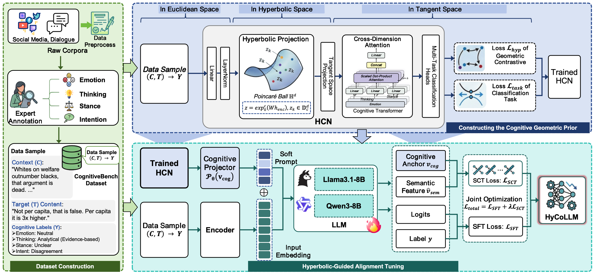

# HyCoLLM: Modeling Multi-Dimensional Cognitive States in Large Language Models under Cognitive Crowding

[](https://2026.aclweb.org/)
[](https://opensource.org/licenses/MIT)

## Overview

**HyCoLLM** is a novel framework that leverages hyperbolic geometry to enhance Large Language Models' understanding of human cognitive states across multiple dimensions: emotion, thinking style, stance, and intent.

### The Cognitive Crowding Problem

Existing LLMs fail to capture the intricate interactions among cognitive dimensions. While they perform well on individual dimensions, their accuracy drops sharply when modeling all four dimensions jointly. We identify **Cognitive Crowding** as the root cause: hierarchical cognitive states require exponential representational space, while Euclidean spaces (used by LLMs) grow only polynomially. This mismatch causes distinct cognitive states to collapse and overlap.

### HyCoLLM Solution

We propose a two-phase framework:
1. **Hyperbolic Cognitive Network (HCN)**: Disentangles multi-dimensional cognitive states in hyperbolic space using the Poincaré ball model
2. **Hyperbolic Guided Alignment Tuning (HGAT)**: Aligns LLM representations with the learned hyperbolic cognitive manifold

### Key Results

- An 8B parameter HyCoLLM model outperforms GPT-4o on multi-dimensional cognitive understanding
- Achieves 15.49% Partial Match Accuracy@4 (Exact Match) vs. GPT-4o's 5.69%
- Narrows the gap to human expert performance (30.76%)

---

## Framework Visualization



---

## Dataset: CognitiveBench

CognitiveBench is the first benchmark with unified annotations across four cognitive dimensions covering 6,514 high-quality samples.

### Dataset Statistics

| Topic | Domain | Valid Samples | Raw Posts | Retention | Unique Users |
|-------|--------|---------------|-----------|-----------|--------------|
| CUT | Trade | 1,445 | 14,773 | 9.8% | 283 |
| UE | Political | 2,090 | 11,234 | 18.6% | 309 |
| DEI | Cultural | 1,227 | 12,759 | 9.6% | 82 |
| FRIR | Economic | 1,752 | 9,730 | 18.0% | 317 |
| **Total** | **Multi-domain** | **6,514** | **48,496** | **13.4%** | **991** |

### Cognitive Dimensions

**Emotion** (Plutchik's model):
- Positive: Joy, Trust, Anticipation, Surprise
- Negative: Anger, Disgust, Fear, Sadness
- Neutral: Neutral (9 classes total)

**Thinking** (Dual Process Theory):
- Intuitive: Subjective Evaluation, Identity Conformity, Emotional Judgment, Experience-Based
- Analytical: Logical, Balanced Consideration, Evidence-Based, Critical (8 classes total)

**Stance** (Social Judgment Theory):
- Support, Oppose, Unclear (3 classes)

**Intent** (Speech Act Theory):
- Representatives: Information Sharing, Opinion Expression
- Directives: Information Seeking, Call to Action
- Expressives: Connection, Conflict, Emotional Expression (7 classes total)

### Inter-Annotator Agreement (Cohen's Kappa)

All dimensions fall within moderate to substantial agreement range (0.51–0.79), indicating reliable annotations for multi-dimensional cognitive analysis.

### Ethical Statement & Content Warning
The CognitiveBench dataset contains raw user-generated content sourced from public social media platforms. Given the nature of the topics covered—such as the **U.S. Election (UE)** and **Diversity, Equity, and Inclusion (DEI)**—users should be aware that the dataset may contain:
* Sensitive Language: Including racial bias, sexism, and political polarization.
* Offensive Content: Potentially harmful or toxic speech reflective of real-world social media discourse.

Disclaimer:
1. The views expressed in the dataset belong solely to the original authors and do not reflect the views of the project contributors or their affiliated institutions.
2. While we have applied systematic filtering (e.g., removing low-signal utterances) and ensured high-quality expert annotation, we maintain the original tone for research integrity.
3. All data has been strictly anonymized to protect user privacy.
4. Users are encouraged to apply application-level safety mechanisms when using models trained on this data.

---

## Code Structure

```
HycoLLM/
├── Dataset/
│   ├── cut/                    # China-US Trade topic
│   │   ├── train_data.json
│   │   ├── test_data.json
│   │   └── labels.json
│   ├── dei/                    # Diversity, Equity, Inclusion
│   │   ├── train_data.json
│   │   ├── test_data.json
│   │   └── labels.json
│   ├── frir/                   # Federal Reserve Interest Rates
│   │   ├── train_data.json
│   │   ├── test_data.json
│   │   └── labels.json
│   └── ue/                     # US Election
│       ├── train_data.json
│       ├── test_data.json
│       └── labels.json
│
├── HCN/                        # Hyperbolic Cognitive Network
│   ├── 01_data_preparation/    # Data preprocessing
│   │   ├── preprocess.py       # Raw data cleaning and filtering
│   │   ├── data_split.py       # Train/test splitting
│   │   ├── prompt_builder.py   # Prompt construction for LLM
│   │   └── unified_preprocessor.py  # Unified preprocessing pipeline
│   │
│   ├── 02_llm_sft/             # LLM Supervised Fine-Tuning
│   │   ├── sft_cognitive.py    # SFT training with LoRA/QLoRA
│   │   ├── evaluate_hcn_llm.py # Evaluation metrics and reporting
│   │   └── utils/
│   │       └── prompts.py      # Prompt templates for cognitive tasks
│   │
│   ├── 03_feature_extraction/  # Hyperbolic Embedding Extraction
│   │   ├── extract_embeddings.py   # Extract HCN embeddings from LLM
│   │   ├── analyze_embeddings.py   # Analysis and visualization
│   │   └── dataset_tensor.py       # PyTorch dataset wrappers
│   │
│   ├── 04_hcn_training/        # HCN Model Training
│   │   ├── train_hcn.py        # Main HCN training script
│   │   ├── models/
│   │   │   ├── hcn_model.py    # HCN architecture
│   │   │   ├── hyperbolic.py   # Poincaré ball operations
│   │   │   └── transformer.py  # Transformer encoder & cross-attention
│   │   ├── loss.py             # Geometry-aware losses (contrastive + task)
│   │   └── dataset_tensor.py   # Data loading for HCN training
│   │
│   └── README.md               # Detailed HCN workflow guide
│
├── HGAT/
│   └── hcn_sft.py              # Hyperbolic-Guided Alignment Tuning
│                                # Integrates HCN geometric priors with LLM SFT
│
├── Figures/
│   └── model.png               # Framework architecture diagram
│
├── requirements.txt            # Python dependencies
└── README.md                   # This file
```

---

## Installation

### Prerequisites
- Python 3.10+
- CUDA 11.8+ (for GPU acceleration)
- 16GB+ GPU memory recommended

### Setup

```bash
# Clone repository
git clone https://github.com/HyCoLLM/HyCoLLM.git
cd HycoLLM

# Install dependencies
pip install -r requirements.txt

# Optional: For faster training with Unsloth
pip install unsloth[colab-new]
```

---

## Quick Start: Complete Pipeline

### Step 1: Data Preparation

```bash
cd HCN/01_data_preparation

# Preprocess raw data
python preprocess.py \
  --input_path ../../Dataset/cut \
  --output_path ./processed_data

# Split train/test sets (default 8:2 ratio)
python data_split.py \
  --input_path ./processed_data \
  --output_path ./split_data
```

### Step 2: LLM Supervised Fine-Tuning (Optional)

If starting from scratch, fine-tune a base LLM on cognitive tasks:

```bash
cd ../02_llm_sft

python sft_cognitive.py \
  --model_name_or_path unsloth/Qwen3-8B-Instruct-bnb-4bit \
  --train_file ../../Dataset/cut/train_data.json \
  --val_file ../../Dataset/cut/test_data.json \
  --per_device_train_batch_size 4 \
  --learning_rate 2e-4 \
  --num_train_epochs 3 \
  --output_dir ./sft_models/cut
```

Default hyperparameters (from paper):
- Learning rate: 2e-4
- Batch size: 4 (per GPU)
- Epochs: 3
- Quantization: 4-bit with QLoRA
- Max tokens: 128

### Step 3: Feature Extraction

Extract embeddings from the fine-tuned LLM:

```bash
cd ../03_feature_extraction

python extract_embeddings.py \
  --model_path ../02_llm_sft/sft_models/cut \
  --data_path ../../Dataset/cut/train_data.json \
  --output_dir ./extracted_features/cut
```

### Step 4: Train Hyperbolic Cognitive Network (HCN)

```bash
cd ../04_hcn_training

python train_hcn.py \
  --train_embeddings_path ../03_feature_extraction/extracted_features/cut/train_embeddings.pt \
  --test_embeddings_path ../03_feature_extraction/extracted_features/cut/test_embeddings.pt \
  --train_labels_path ../../Dataset/cut/labels.json \
  --test_labels_path ../../Dataset/cut/labels.json \
  --batch_size 32 \
  --epochs 50 \
  --lr 1e-3 \
  --output_dir ./hcn_models/cut
```

Default hyperparameters (from paper):
- Batch size: 32
- Learning rate: 1e-3
- Epochs: 50
- Hyperbolic curvature: 1.0
- Hidden dimension: 768
- Lambda (hyperbolic regularization): 0.1
- Margin (contrastive loss): 0.5

### Step 5: Hyperbolic-Guided Alignment Tuning (HGAT)

Integrate HCN geometric priors with LLM:

```bash
cd ../../HGAT

python hcn_sft.py \
  --hcn_model_dir ../HCN/04_hcn_training/hcn_models/cut \
  --feature_extraction_model ../HCN/02_llm_sft/sft_models/cut \
  --train_data_path ../Dataset/cut/train_data.json \
  --test_data_path ../Dataset/cut/test_data.json \
  --per_device_train_batch_size 4 \
  --learning_rate 2e-4 \
  --num_train_epochs 3 \
  --output_dir ./hgat_models/cut
```

HGAT hyperparameters (from paper):
- Learning rate: 2e-4
- Batch size: 4
- Epochs: 3
- SCT loss weight (lambda): 1.0
- Soft prompt length: Dynamic

### Step 6: Evaluation

```bash
# Evaluate on test set
python ../HCN/02_llm_sft/evaluate_hcn_llm.py \
  --model_path ./hgat_models/cut \
  --test_data_path ../Dataset/cut/test_data.json \
  --output_dir ./results
```

---

## Model Architecture Details

### Hyperbolic Cognitive Network (HCN)

**Input**: Text embeddings from fine-tuned LLM (dimension: 768)

**Architecture**:
1. **Hyperbolic Projection**: Project cognitive dimensions to Poincaré ball
   - 4 separate projection heads for emotion, thinking, stance, intent
   - Exponential map: Euclidean → Hyperbolic

2. **Cross-Dimensional Attention**: Transformer encoder with cross-attention
   - Self-attention within each cognitive dimension
   - Cross-attention between dimensions
   - Output: Unified cognitive anchor v_cog

3. **Multi-Task Classification**:
   - 4 classification heads (one per dimension)
   - Classes: 9 (emotion), 8 (thinking), 3 (stance), 7 (intent)

**Losses**:
- Task loss: Cross-entropy for 4 classification tasks
- Hyperbolic regularization: Poincaré distance-based contrastive loss (Eq. 5-6 in paper)
- Combined: L = L_task + lambda_hyp * L_hyp (lambda_hyp = 0.1)

### Hyperbolic-Guided Alignment Tuning (HGAT)

**Phase 1**: Train HCN on extracted embeddings (frozen LLM)

**Phase 2**: Align LLM with HCN via:
1. **Soft Prompt Injection**: Project v_cog to soft prompt tokens
2. **Semantic-Cognitive Topology Loss (SCT)**:
   - Extract LLM last hidden state
   - Align with cognitive anchor via cosine similarity
   - Loss: L_SCT = 1 - (v_sem · v_cog) / (||v_sem|| ||v_cog||)
3. **Joint Optimization**: SFT loss + lambda * L_SCT (lambda = 1.0)

---

## Model Weights and Adapters

Pre-trained model weights and LoRA adapters are available on HuggingFace:

- **Base models**: Please download the llama3.1-8b and qwen3-8b models yourself.
- **LoRA adapters**: [https://huggingface.co/Chips95/HyCoLLM_for_ACL2026](LoRA adapters for llama3.1-8b and qwen3-8b under the three topics of ue, cut, and dei)

### Usage

```python
from peft import AutoPeftModelForCausalLM
from transformers import AutoTokenizer

# Load HyCoLLM adapter
model = AutoPeftModelForCausalLM.from_pretrained(
    "HyCoLLM/HyCoLLM-Qwen3-8B-adapters",
    torch_dtype="auto",
    device_map="auto"
)
tokenizer = AutoTokenizer.from_pretrained("Qwen/Qwen3-8B-Instruct")

# Inference
inputs = tokenizer("Your text here", return_tensors="pt")
outputs = model.generate(**inputs)
print(tokenizer.decode(outputs[0]))
```

---

## Experimental Results

### Main Performance Metrics

| Model | Emotion ACC | Thinking ACC | Stance ACC | Intent ACC | PMA@4 (Exact Match) |
|-------|------------|-------------|-----------|-----------|------------------|
| Human Expert | 72.51% | 64.00% | 80.21% | 72.01% | 30.76% |
| GPT-4o | 51.56% | 32.59% | 65.96% | 48.34% | **5.69%** |
| Qwen3-8B (SFT only) | 58.67% | 43.08% | 64.88% | 61.13% | 10.91% |
| **HyCoLLM-Qwen3-8B** | **62.86%** | **53.34%** | **70.33%** | **64.75%** | **15.49%** |

### Ablation Study

| Component | PMA@4 | Delta |
|-----------|-------|-------|
| HyCoLLM (Full) | 15.49% | baseline |
| w/o Hyperbolic | 12.16% | -3.33% |
| w/o Geo-Regularization | 12.04% | -3.45% |
| w/o Soft Prompt | 11.76% | -3.73% |
| w/o SCT Loss | 12.52% | -2.97% |

### Human Evaluation

HyCoLLM wins 67% against Llama3.1-8B (SFT) and 42% against GPT-4o in blind pairwise evaluation of overall cognitive state consistency.

---

## Configuration & Hyperparameters

All default hyperparameters are specified in code and match the paper:

```python
# HCN Training (04_hcn_training/train_hcn.py)
BATCH_SIZE = 32
LEARNING_RATE = 1e-3
EPOCHS = 50
HIDDEN_DIM = 768
HYPERBOLIC_CURVATURE = 1.0
LAMBDA_HYPERBOLIC = 0.1
MARGIN_CONTRASTIVE = 0.5

# LLM SFT (02_llm_sft/sft_cognitive.py)
PER_DEVICE_BATCH_SIZE = 4
LLM_LEARNING_RATE = 2e-4
SFT_EPOCHS = 3
QUANTIZATION = 4-bit (QLoRA)
MAX_TOKENS = 128

# HGAT (HGAT/hcn_sft.py)
LAMBDA_SCT = 1.0
SOFT_PROMPT_LENGTH = Dynamic
```

---

## Citation

If you use HyCoLLM in your research, please cite:

```bibtex
@inproceedings{zhong2026hycollm,
  title={Modeling Multi-Dimensional Cognitive States in Large Language Models under Cognitive Crowding},
  author={Zhong, Lin and Zhu, Siyu and Yuan, Zizhen and Cui, Jinhao and Zhao, Xinyang and Wang, Lingzhi and Chen, Hao and Liao, Qing},
  booktitle={Proceedings of the 64th Annual Meeting of the Association for Computational Linguistics},
  year={2026}
}
```

---

## License

This project is licensed under the MIT License. See LICENSE file for details.

---

## Acknowledgments

This work was supported by Harbin Institute of Technology, City University of Macau, and Peng Cheng Laboratory. We thank the 29 domain experts for their meticulous annotation work and the ACL 2026 reviewers for their valuable feedback.

---

## Contact & Support

For questions or issues:
- GitHub Issues: [HyCoLLM/HyCoLLM/issues](https://github.com/HyCoLLM/HyCoLLM/issues)
- Email: liaoqing@hit.edu.cn

---

## Related Resources

- Paper: [ACL 2026 Proceedings](https://aclweb.org/papers)
- Models: [HuggingFace Hub](https://huggingface.co/Chips95/HyCoLLM_for_ACL2026)
